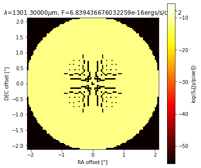

# AstroWind: Disk Wind Simulator

This program simulates aspects of stellar accretion disk winds. Key computations involve detailed analyses of mass-loss rates, wind velocities (both azimuthal and poloidal components), and the cylindrical radius on a 3D Cartesian grid. 
 
## Acknowledgements

This project was completed by myself for the SETI Spring 2024 internship, under the supervision of Dr. Uma Gorti. I would like to express my deepest appreciation to Dr. Gorti for her guidance and support throughout the course of this project. 

From June to August 2024, this project was continued by Sophie Clark from University of Florida who continued to fine tune the model to enhance the accuracy of images. 

As of September 2024, this project is not being worked on by anyone, but it is the first step in a two year research project being conducted by Dr. Gorti. Please reach out to her for further questions.

## Prerequisites

- [Python](https://www.python.org/)
- [Jupyter Notebook](https://jupyter.org/install)
- [Matplotlib](https://matplotlib.org/stable/users/installing.html)
- [NumPy](https://numpy.org/install/)
- [SciPy](https://www.scipy.org/install.html)

## Setup and Execution

Follow these steps to compute and view the density map:

1. **Density Computation**:
   - Navigate to the source directory.
   - Run the following command to generate the `wind_density_output.csv` file:
     ```bash
     python parameters\wind_density.py
     ```

2. **Viewing the Density Map**:
   - If you have Jupyter Notebook installed, open `density_map.ipynb`.
   - Alternatively, run `density_map.py` if you do not have Jupyter Notebook:
     ```bash
     python density_map.py
     ```

## Expected Output

Upon successful execution with correctly defined parameters, you should observe a cone-like structure radiating outwards in the density map. If this is not the case, please double-check your parameters to ensure they align with the expected measurements.


Next, continue onto the radmc3d_setup to learn how to integrate this data with the RADMC3D, which is a diagnostic radiative transfer calculator. This will allow us to use the geometrical distribution of gas and/or dust, what its images and/or spectra look like when viewed from a certain angle, allowing modelers to compare their models with observed data. Here's a sample!




