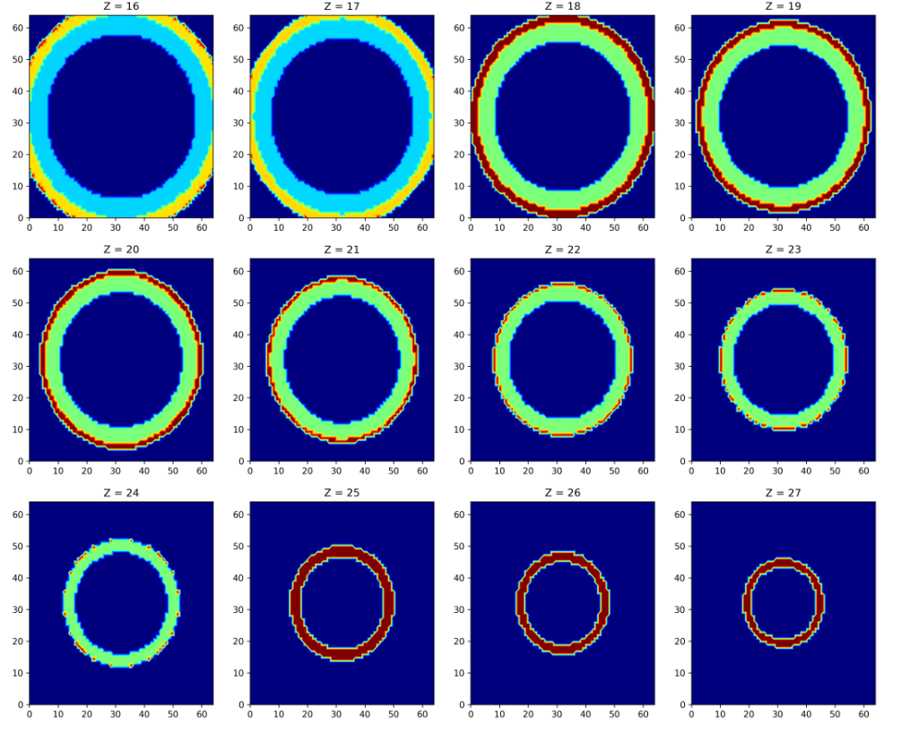

# AstroWind: Disk Wind Simulator

This program simulates aspects of stellar accretion disk winds. Key computations involve detailed analyses of mass-loss rates, wind velocities (both azimuthal and poloidal components), and the cylindrical radius on a 3D Cartesian grid. 
 

## Prerequisites

- [Python](https://www.python.org/)
- [Jupyter Notebook](https://jupyter.org/install)
- [Matplotlib](https://matplotlib.org/stable/users/installing.html)
- [NumPy](https://numpy.org/install/)
- [SciPy](https://www.scipy.org/install.html)

## Setup and Execution

Follow these steps to compute and view the density map:

1. **Density Computation**:
   - Navigate to the source directory.
   - Run the following command to generate the `wind_density_output.csv` file:
     ```bash
     python parameters\wind_density.py
     ```

2. **Viewing the Density Map**:
   - If you have Jupyter Notebook installed, open `density_map.ipynb`.
   - Alternatively, run `density_map.py` if you do not have Jupyter Notebook:
     ```bash
     python density_map.py
     ```

## Expected Output

Upon successful execution with correctly defined parameters, you should observe a cone-like structure radiating outwards in the density map. If this is not the case, please double-check your parameters to ensure they align with the expected measurements.



## Acknowledgements

This project was completed by myself for the SETI Spring 2024 internship, under the supervision of Dr. Uma Gorti. 
I would like to express my deepest appreciation to Dr. Gorti for her guidance and support throughout the 
course of this project. 

As of June 2024, this project will be maintained by Sophie Clark as part of the SETI Institute 2024 REU Program. 

## Contributing

Any contributions you make are **greatly appreciated**. I have left many remarks on the code
for features I am looking to implement. 

1. Fork the Project
2. Create your Feature Branch (`git checkout -b feature/Feature`)
3. Commit your Changes (`git commit -m 'Add some Feature'`)
4. Push to the Branch (`git push origin feature/Feature`)
5. Open a Pull Request

