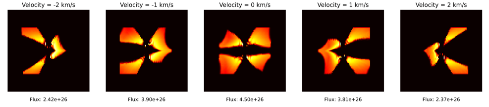
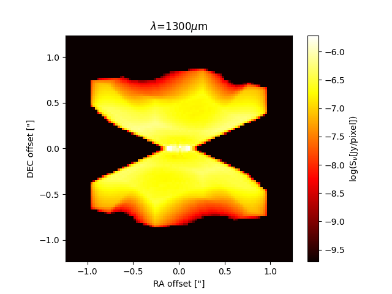

# LTE3D Setup Guide

This setup guide is designed for the LTE3D project. The project uses data from the [Disc-Wind-Density-Program (DWDP)](https://github.com/K1zum1/Disc-Wind-Density-Program) to generate visual outputs with RADMC3D.

## Prerequisites

Before you begin, ensure you have met the following requirements:

- **RADMC3D**: Ensure RADMC3D is compiled and ready on your system.
- **Disc-Wind-Density-Program Data**: You should be able to generate data through the DWDP program.

## Installation and Execution

To initiate the LTE3D model, follow these steps:

1. If not already compiled, compile RADMC3D on your system.
2. Navigate to the directory containing the setup files for the LTE3D model.
3. Copy the files found in the setup directory, and paste them into the LTE3D model.
4. Run the scripts in the order stated below. This is crucial for the correct execution of the model.

## Prerequisites

Before executing any code, ensure your model contains the following files:

- `dustkappa_silicate.inp`
- `Makefile`
- `molecule_co.inp`
- `problem_setup.py`
- `velocityChannelmapper.py`
- `master.py`
- `newvel`

These files are essential for the correct functioning of the model.

## Warning
**The only file you should be modifying is parameters.py.**

**Modifying any other files may result in the program potentially do unexpected things.**

**Only make changes to the model and setup if you know what to change**

# Velocity Channel Map

Run the model to generate data, and the setup
```python
python3 master.py
python3 problem_setup.py
```
**Everytime you change a parameter in parameters.py, you must rerun the setup again to see the new results**

```bash
radmc3d mctherm setthreads <number_of_threads> # replace <number_of_threads> with the desired number
```
Create a directory called velocity_channels for the newvel function
```bash
mkdir velocity_channels
``` 
If you run into permission issues, run the following
```bash
chmod +x newvel
```
This function will generate the image,out* files into the specified directory
```bash
./newvel <number1> <number2> # replace <number1> and <number2> with the desired numbers
```
This will then generate the image
```python
python3 velocityChannelmapper.py
```

A successful execution should yield an image named `velocity_channel_visualization.png` as such:



Anytime you want to rerun `newvel`, the `velocity_channel_visualization.png` will be overwritten so please save the image if you need it later.

# View a single image

Run the model to generate data, and the setup
```python
python3 master.py
python3 problem_setup.py
```
**Everytime you change a parameter in parameters.py, you must rerun the setup again to see the new results**

For an image with an inclination of 80 degrees and a line velocity of 2 km/s:
```bash
radmc3d image incl 80 iline 2 vkms 7
```
For an image at 1300 microns with an inclination of 70 degrees and azimuthal angle of 30 degrees:
```bash
radmc3d image lambda 1300 incl 70 phi 30
```
To read the image do the following

Go into python (don't forget the --matplotlib):

```python
from radmc3dPy.image import *
from matplotlib import cm
a=readImage()
plotImage(a,log=True,maxlog=4,cmap=cm.hot,bunit='snu',dpc=140,arcsec=True)
```

Alternatively you can also run `executeWind.py` which will also save and show an image

