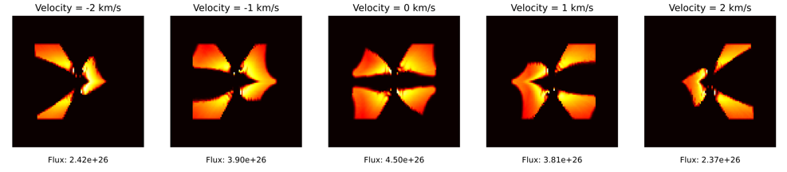

# LTE3D Setup Guide

This setup guide is designed for the LTE3D project. The project uses data from the [Disc-Wind-Density-Program (DWDP)](https://github.com/K1zum1/Disc-Wind-Density-Program/blob/main/source/parameters/wind_density_output.csv) to generate visual outputs with RADMC3D.

## Prerequisites

Before you begin, ensure you have met the following requirements:

- **RADMC3D**: Ensure RADMC3D is compiled and ready on your system.
- **Disc-Wind-Density-Program Data**: You should be able to generate data through the DWDP program.

## Installation and Execution

To initiate the LTE3D model, follow these steps:

1. **Compile RADMC3D**: If not already compiled, compile RADMC3D on your system.
2. **Navigate to the Directory**: Navigate to the directory containing the setup files for the LTE3D model.
3. **Run the Scripts**: Run the scripts in the order stated below. This is crucial for the correct execution of the model.

## Warning

**If you change a paramter in parameters.py, you must rerun the setup again to see the new results** 

# Velocity Channel Map

Run the model to generate data, and the setup
```python
python3 master.py
python3 problem_setup.py
```

```bash
radmc3d mctherm setthreads <number_of_threads> # replace <number_of_threads> with the desired number
```

```bash
./newvel <number1> <number2> # replace <number1> and <number2> with the desired numbers
```

```python
python3 velocityChannelmapper.py
```

A successful execution should yield an image as such:



# View a single image

Run the model to generate data, and the setup
```python
python3 master.py
python3 problem_setup.py
```

For an image with an inclination of 80 degrees and a line velocity of 2 km/s:
```bash
radmc3d image incl 80 iline 2 vkms 7
```
For an image at 1300 microns with an inclination of 70 degrees and azimuthal angle of 30 degrees:
```bash
radmc3d image lambda 1300 incl 70 phi 30
```
To read the image do the following

Go into python (don't forget the --matplotlib):

```python
 from radmc3dPy.image import *
 from matplotlib import cm
 a=readImage()
 plotImage(a,log=True,maxlog=4,cmap=cm.hot,bunit='snu',dpc=140,arcsec=True)
 ```